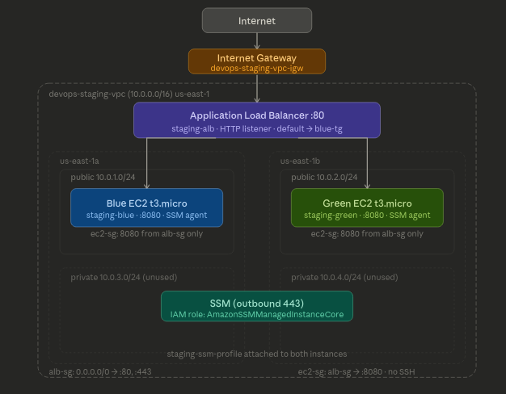
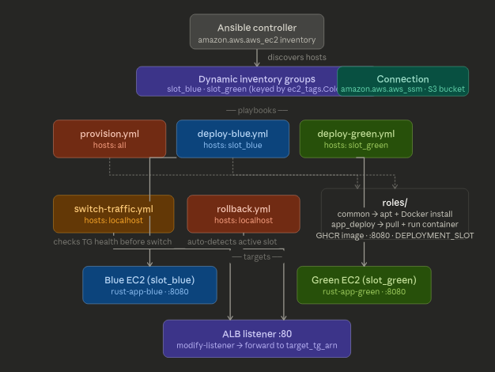

# devops-pipeline-aws

> Production-grade blue/green deployment pipeline for a Rust microservice.
> Terraform (AWS) · Ansible · GitHub Actions · Zero-downtime · Automated rollback.

<!--  -->


---

## What this project demonstrates

| Skill | Technology |
|-------|-----------|
| Application | Rust (Actix-web) — REST API with `/health` endpoint |
| Containerization | Docker multi-stage build |
| Infrastructure as Code | Terraform — AWS VPC, Security Groups, EC2, ALB, S3 |
| Configuration Management | Ansible — roles, playbooks, Jinja2 templates |
| CI/CD Pipeline | GitHub Actions — test, build, deploy, switch, rollback |
| Deployment Strategy | Blue/Green — zero-downtime, automated healthcheck + rollback |
| State Management | Terraform remote state — S3 with `use_lockfile` (native S3 locking) |
| Instance Access | AWS Systems Manager (Session Manager) — no SSH, no public IP |

---

## Architecture

```
┌─────────────────────────────────────────────────────┐
│                    GitHub Actions                    │
│  push → test → build Docker → deploy → switch ALB   │
└──────────────────┬──────────────────────────────────┘
                   │
         ┌─────────▼──────────┐
         │   Terraform (AWS)  │
         │  VPC+SG+ ALB+EC2x2 │
         └─────────┬──────────┘
                   │
        ┌──────────▼───────────┐
        │   Ansible Playbooks  │
        │  provision + deploy  │
        └──────┬───────┬───────┘
               │       │
        ┌──────▼─┐  ┌──▼─────┐
        │  BLUE  │  │ GREEN  │
        │  EC2   │  │  EC2   │
        │ :8080  │  │ :8080  │
        └──────┬─┘  └──┬─────┘
               │       │
        ┌──────▼───────▼──────┐
        │   AWS ALB (port 80) │
        │  target group switch│
        └─────────────────────┘
```

**Deployment flow:**
1. Developer pushes to `main`
2. CI runs tests + builds Docker image + pushes to GHCR
3. Manual trigger: choose slot (`blue` or `green`)
4. Ansible deploys new image to **inactive** slot
5. Healthcheck passes → ALB switches 100% traffic to new slot
6. Old slot stays warm → rollback in < 30s if anything fails


---

## Project structure

```
devops-pipeline-aws/
├── app/                         ← Rust API (Actix-web)
│   ├── src/
│   │   ├── main.rs
│   │   ├── routes/
│   │   │   ├── health.rs
│   │   │   └── api.rs
│   │   └── config.rs
│   ├── Cargo.toml
│   └── Dockerfile
├── terraform/
│   ├── modules/
│   │   ├── vpc/
│   │   ├── security-groups/
│   │   ├── ec2/
│   │   └── alb/
│   └── environments/
│       ├── staging/
│       │   ├── backend.tf
│       │   ├── main.tf
│       │   ├── variables.tf
│       │   ├── outputs.tf
│       │   └── terraform.tfvars
│       └── production/
├── ansible/
│   ├── inventory/
│   │   └── staging.aws_ec2.yml  ← Dynamic inventory via AWS EC2 plugin
│   ├── roles/
│   │   ├── common/
│   │   └── app_deploy/
│   ├── playbooks/
│   │   ├── provision.yml
│   │   ├── deploy-blue.yml
│   │   ├── deploy-green.yml
│   │   ├── switch-traffic.yml
│   │   └── rollback.yml
│   └── ansible.cfg
├── scripts/
│   ├── switch-traffic.sh
│   ├── healthcheck.sh
│   └── rollback.sh
├── .github/
│   └── workflows/
│       ├── ci.yml
│       ├── deploy-staging.yml
│       └── deploy-prod.yml
├── docs/
├── ROADMAP.md
└── README.md
```

---

## Quick start

### 1. Clone the repository

```bash
git clone https://github.com/nareph/devops-pipeline-aws
cd devops-pipeline-aws
```

All subsequent commands assume you are in the project root directory (`devops-pipeline-aws/`).

---

## Prerequisites & Manual Steps



### AWS — One-time setup

**1. Create IAM user `terraform-user`**

Required permissions: `AmazonEC2FullAccess`, `AmazonS3FullAccess`, `AmazonDynamoDBFullAccess`,
`ElasticLoadBalancingFullAccess`, `AmazonVPCFullAccess`, `IAMFullAccess` (for SSM role)

Generate Access Key + Secret Key → configure AWS profile:

```bash
aws configure --profile terraform-user
# AWS Access Key ID: ...
# AWS Secret Access Key: ...
# Default region: us-east-1
# Default output format: json
```

**2. Create the S3 bucket for Terraform state**

```bash
BUCKET_NAME="devops-pipeline-tfstate-$(whoami)-$(date +%Y%m%d)"

aws s3 mb s3://${BUCKET_NAME} --region us-east-1 --profile terraform-user

aws s3api put-bucket-versioning \
  --bucket ${BUCKET_NAME} \
  --versioning-configuration Status=Enabled \
  --region us-east-1 --profile terraform-user
```

**3. Create the S3 bucket for Ansible SSM file transfer**

The Ansible SSM connection plugin requires a dedicated S3 bucket to transfer module files
to remote instances. This is separate from the Terraform state bucket.

```bash
aws s3 mb s3://devops-pipeline-ansible-ssm-$(whoami) --region us-east-1
```

Then attach S3 access to your EC2 instance role (replace `staging-ssm-role` with your actual role name):

```bash
aws iam put-role-policy \
  --role-name staging-ssm-role \
  --policy-name ansible-ssm-s3 \
  --policy-document '{
    "Version": "2012-10-17",
    "Statement": [{
      "Effect": "Allow",
      "Action": [
        "s3:GetObject",
        "s3:PutObject",
        "s3:DeleteObject",
        "s3:ListBucket"
      ],
      "Resource": [
        "arn:aws:s3:::devops-pipeline-ansible-ssm-YOUR_USERNAME",
        "arn:aws:s3:::devops-pipeline-ansible-ssm-YOUR_USERNAME/*"
      ]
    }]
  }'
```

**4. Install the AWS Session Manager plugin on your controller machine**

Required for SSM-based connections from your local machine:

```bash
# Debian/Ubuntu
curl "https://s3.amazonaws.com/session-manager-downloads/plugin/latest/ubuntu_64bit/session-manager-plugin.deb" \
  -o /tmp/ssm-plugin.deb
sudo dpkg -i /tmp/ssm-plugin.deb

# Verify
session-manager-plugin --version
```

**5. Configure Terraform variables**

Create `terraform/environments/staging/terraform.tfvars` (do not commit):

```hcl
aws_region     = "us-east-1"
aws_profile    = "terraform-user"
environment    = "staging"
instance_type  = "t3.micro"
bucket_name    = "YOUR_TFSTATE_BUCKET_NAME"
```

---

### Terraform — Deploy infrastructure

```bash
# Export the AWS profile before terraform init
# (the backend S3 is initialized before variables are loaded)
export AWS_PROFILE=terraform-user

cd terraform/environments/staging
terraform init
terraform plan
terraform apply

# Destroy when done (avoids AWS charges)
terraform destroy
```

---

### Ansible — Configuration & Deployment



**1. Set up Python virtual environment**

```bash
python3 -m venv .venv
source .venv/bin/activate
pip install ansible boto3 botocore

# Install required Ansible collections
ansible-galaxy collection install amazon.aws --force
```

> **Important:** always activate the venv before running any `ansible` or
> `ansible-playbook` commands. The `amazon.aws` collection must be installed
> inside the same venv that Ansible runs from.

**2. Configure `ansible/ansible.cfg`**

```ini
[defaults]
inventory = inventory/
host_key_checking = False
retry_files_enabled = False
stdout_callback = default
display_args_to_stdout = True
timeout = 30
interpreter_python = auto_silent
roles_path = roles/
deprecation_warnings = False
system_warnings = False
action_warnings = False
remote_tmp = /tmp/.ansible/tmp

[ssh_connection]
pipelining = True
```

> **Notes:**
> - Do not set `remote_user` — SSM connects as `ssm-user`, not `ubuntu`.
>   Privilege escalation is handled by `ansible_become: true`.
> - `remote_tmp` must point to `/tmp` — SSM users do not have a home directory.
> - `interpreter_python = auto_silent` lets Ansible auto-detect Python on both
>   the controller and remote hosts — no hardcoded paths needed.

**3. Configure dynamic inventory**

Create `ansible/inventory/staging.aws_ec2.yml`:

```yaml
plugin: amazon.aws.aws_ec2
regions:
  - us-east-1
filters:
  tag:Environment: staging
keyed_groups:
  - key: ec2_tags.Color      # use ec2_tags, not tags (tags is a reserved name)
    prefix: slot
hostnames:
  - instance-id              # ansible_host must be the instance ID for SSM
compose:
  ansible_host: instance_id
  ansible_connection: "'amazon.aws.aws_ssm'"
  ansible_become: "true"
  ansible_become_method: "'sudo'"
  ansible_python_interpreter: "'/usr/bin/python3'"   # Python on the remote host
  ansible_aws_ssm_bucket_name: "'devops-pipeline-ansible-ssm-YOUR_USERNAME'"
  ansible_aws_ssm_region: "'us-east-1'"
  ansible_remote_tmp: "'/tmp/.ansible/tmp'"
```

> **Important inventory notes:**
> - The filename **must** end in `aws_ec2.yml` for the plugin to be auto-detected.
> - `ansible.aws.aws_ssm` is an **inventory plugin** — use `amazon.aws.aws_ec2`
>   for discovery and `amazon.aws.aws_ssm` only as the connection method.
> - Use `ec2_tags` (not `tags`) in `keyed_groups` to avoid reserved variable warnings.
> - Values in `compose` that are strings must be double-quoted inside single quotes,
>   e.g. `"'amazon.aws.aws_ssm'"`.

**4. Test inventory**

```bash
cd ansible
ansible-inventory -i inventory/staging.aws_ec2.yml --list
```

You should see your EC2 instances grouped as `slot_blue` and `slot_green`.

**5. Provision servers (install Docker)**

```bash
ansible-playbook -i inventory/staging.aws_ec2.yml playbooks/provision.yml
```

**6. Deploy the application**

```bash
# Deploy to Blue slot
ansible-playbook -i inventory/staging.aws_ec2.yml playbooks/deploy-blue.yml --limit slot_blue

# Deploy to Green slot
ansible-playbook -i inventory/staging.aws_ec2.yml playbooks/deploy-green.yml --limit slot_green

# Verify via ALB
ALB_DNS=$(cd ../terraform/environments/staging && terraform output -raw alb_dns_name)
curl http://${ALB_DNS}/health
```

**7. Blue/Green traffic switch**

```bash
# Switch traffic to Green
ansible-playbook -i inventory/staging.aws_ec2.yml playbooks/switch-traffic.yml -e "target_slot=green"

# Verify slot changed
curl http://${ALB_DNS}/health

# Rollback if needed
ansible-playbook -i inventory/staging.aws_ec2.yml playbooks/rollback.yml
```

---

## Quick start (local)

```bash
# 1. Clone
git clone https://github.com/nareph/devops-pipeline-aws
cd devops-pipeline-aws

# 2. Run app locally
cd app && cargo run

# 3. Test health endpoint
curl http://localhost:8080/health
```

---

## Important — Infrastructure lifecycle

The CI/CD pipeline deploys the **application** but does NOT manage infrastructure.
Infrastructure is managed separately with Terraform from your local machine.

**Before the first deployment:**
```bash
# 1. Provision AWS resources
cd terraform/environments/staging
terraform apply

# 2. Push to main to trigger the pipeline
git push origin main
```

**To tear down (avoid AWS costs):**
```bash
cd terraform/environments/staging
terraform destroy
```

> If you run `terraform destroy` and then push to `main`, the deploy workflow will
> fail immediately at the "Verify infrastructure exists" step with a clear message
> rather than a cryptic error deep in the Ansible steps:
> ```
> ❌ Infrastructure not found — run 'terraform apply' first
> ```
> This is expected behaviour — simply run `terraform apply` again to restore the
> infrastructure and re-trigger the workflow.

---

## Troubleshooting

### `unknown plugin 'amazon.aws.aws_ssm'`
`aws_ssm` is not an inventory plugin — it is a connection plugin. Use `amazon.aws.aws_ec2`
as the inventory plugin and set `ansible_connection: amazon.aws.aws_ssm` in `compose`.

### `Failed to import boto3/botocore`
Install inside your venv, not system-wide:
```bash
source .venv/bin/activate
pip install boto3 botocore
```

### `HeadBucket 404 — Not Found`
The S3 bucket for SSM file transfer does not exist or the bucket name in
`ansible_aws_ssm_bucket_name` is wrong. Create the bucket and verify the name matches.

### `mkdir: cannot create directory '/home/ubuntu': Permission denied`
SSM connects as `ssm-user`, which has no home directory. Set `remote_tmp = /tmp/.ansible/tmp`
in `ansible.cfg` and `ansible_remote_tmp: "'/tmp/.ansible/tmp'"` in the inventory compose block.

### `module interpreter '../.venv/bin/python3' was not found`
A relative path in `interpreter_python` gets sent to the remote host, which does not have
your local venv. Use `auto_silent` to let Ansible auto-detect the right Python on each host:
```ini
interpreter_python = auto_silent
```

---

## Cost

Running on AWS Free Tier: **~$0/month**

| Resource | Cost |
|----------|------|
| 2x EC2 `t3.micro` | 750h free/month |
| ALB | ~$0.008/LCU-hour, minimal traffic |
| S3 (state + SSM buckets) | 5GB, 20k GET requests free |
| VPC, Subnets, IGW, Route Tables | Free |

> **Destroy infra when not in use:** `terraform destroy`

---

## Roadmap

See [ROADMAP.md](./ROADMAP.md) for the detailed step-by-step learning path.

**Progress:**
- [ ] Phase 0 — Project setup & Git workflow
- [ ] Phase 1 — Rust application + Docker
- [ ] Phase 2 — Terraform (AWS infrastructure)
- [ ] Phase 3 — Ansible (configuration & deployment)
- [ ] Phase 4 — GitHub Actions (CI/CD pipeline)
- [ ] Phase 5 — Blue/Green switch & rollback
- [ ] Phase 6 — Documentation & polish

---

## License

MIT © [Nareph Frank Menadjou](https://github.com/nareph)
